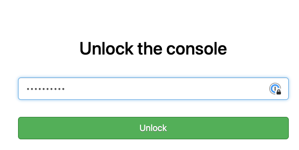
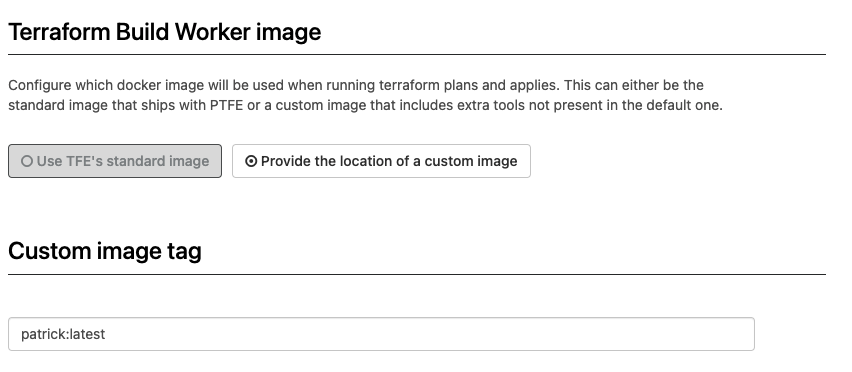
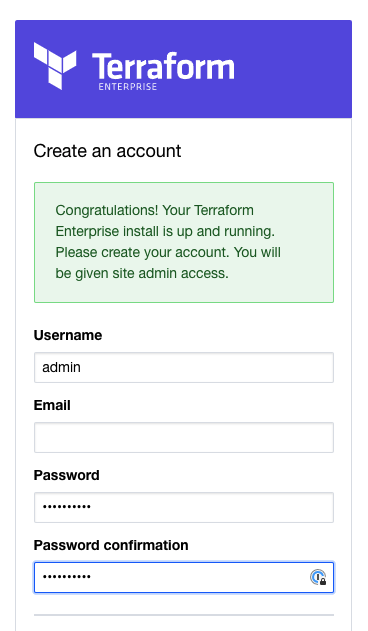
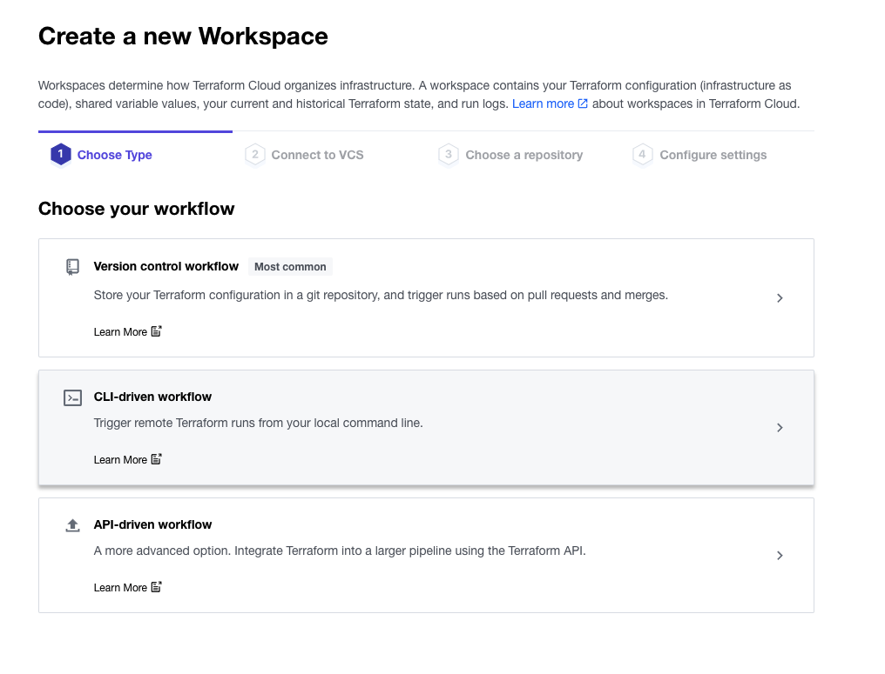
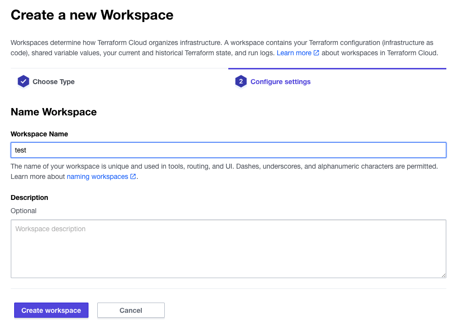
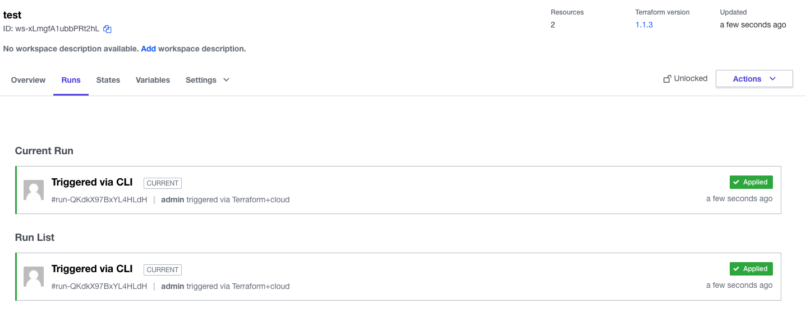

# TFE_with_custom_worker

In this repository you will use a custom worker for Terraform Enterprise to use.

This repo uses Vagrant to create a virtual machine.

Vagrant virtual machine:
- ubuntu virtual machine starts
- TLS/SSL self-signed certificates will be created and used by TFE installation
- TFE settings file will be used from ```/vagrant/config/tfe_settings.json```
- Replicated configuration file will be used from ```/etc/replicated.conf```
- TFE installation script will be downloaded and executed
- the first admin user will be created within TFE to use with settings created under ```/vagrant/config/create_tfe_user.json```

# Documentation references
HashiCorp official documentation: [See here](https://www.terraform.io/enterprise/install/interactive/installer#alternative-terraform-worker-image)  
HashiCorp Engineer Github Repo on building custom workers: [See here](https://github.com/straubt1/tfe-alternative-worker)

# Prerequisites

## Vagrant
Vagrant [See documentation](https://www.vagrantup.com/docs/installation)  
Virtualbox [See documentation](https://www.virtualbox.org/wiki/Downloads)

## license 

License file stored as ```license.rli``` under ```config/```

# using the repo

## Dashboard configuration
- start vagrant
```
vagrant up
```
- login to replicated dashboard
```
http://192.168.56.33:8800
```
- login using the password ```Password#1```  
  
- go to settings -> Terraform Build Worker image
- change default image to ```Provide the location of the custom image```
- Custom image tag: ```patrick:latest```  
  
- Save settings on the bottem
## build the custom docker image
- Login to vagrant
```
vagrant ssh
```
- Go to the directory ```/vagrant/docker_custom_image```
```
cd /vagrant/docker_custom_image
```
- we need the certificate that TFE generated stored on disk
```
echo -n | openssl s_client -connect 192.168.56.33.nip.io:443 | openssl x509 > tfe_certificate.crt
```
- build the custom docker image
```
sudo docker build -t patrick .
```
## Configure TFE
- Go to the TFE dashboard and click on the link for the TFE application


- create a first account   
  
- create an organisation ```patricktest```  
  
- create a new workspace with CLI-driven workflow  
  
- create a workspace named test  
  

## run terraform with the custom image
- open an new terminal on your laptop
- go to the directory terraform
```
cd terraform
```
- login to the terraform enterprise environment
```
terraform login 192.168.56.33.nip.io
```
- run terraform init
```
terraform init
```
- run terraform plan
```
terraform plan
```
- run terraform apply
```
terraform apply
```
output
```
null_resource.patrick2: Creating...
null_resource.patrick: Creating...
null_resource.patrick: Creation complete after 0s [id=9087627740534579712]
null_resource.patrick2: Creation complete after 0s [id=7469545037961622205]

Apply complete! Resources: 2 added, 0 changed, 0 destroyed.
```
- login to your TFE environment and look at the runs   
  